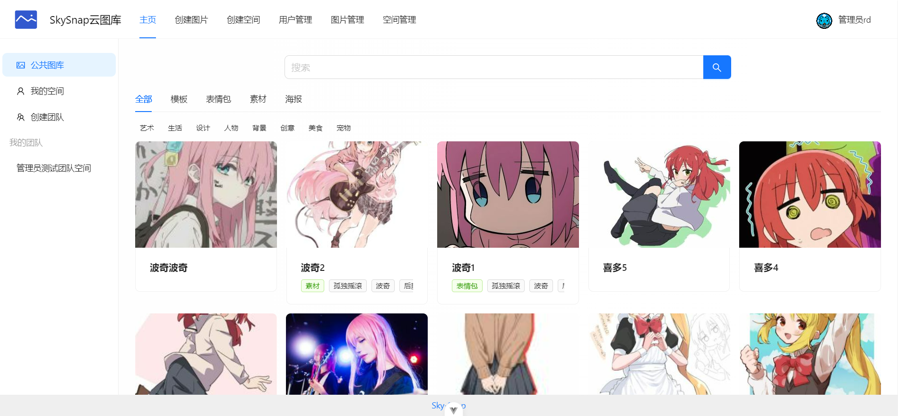
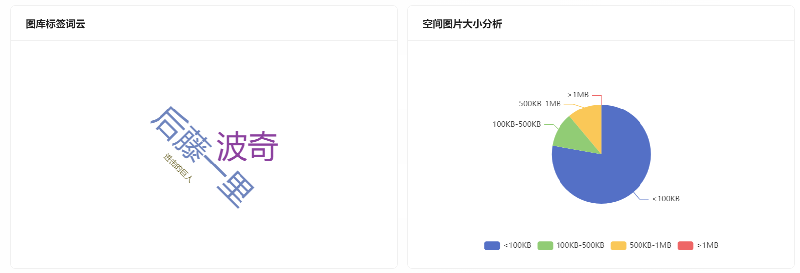

# Sky-Snap

**Sky‑Snap** 是一款基于 **Spring Boot 2.7 + Redis + Tencent COS + 阿里云 AI + WebSocket** 的开源云图库平台，为个人与团队提供图片的 **上传、管理、协作、分享与智能标注** 能力。
前端采用 **Vue 3 + Vite + Ant Design Vue**，支持灵活的二次开发与私有化部署。

## 💻 安裝

### Git 安裝

```powershell
git clone -b main https://github.com/RJLante/Sky-Snap
```

#### 在线体验：http://118.25.143.47/    管理员账号：admin 密码：yx828282

## ⚙ 项目简介

**Sky‑Snap** 将图库分为了公共图库与个人私有空间，用户可以在主页访问公共图库，并在公共图库上传图片，目前支持多种图片上传方式：

1. **文件上传**：在图片创建页面点击上传按钮或直接拖动图片上传。
2. **URL 上传**：在图片创建页面输入图片网址（URL）上传。
3. **批量上传（管理员）**：使用 `jsoup` 获取网站页面批量获取并上传相关图片。




### 功能一览

| 模块                | 亮点功能                                                     |
| ------------------- | ------------------------------------------------------------ |
| **用户与权限**      | 账号注册 / 登录、角色（普通用户 / 管理员）、基于 AOP 的 `@AuthCheck` 权限拦截; 基于 Sa-Token 的 Kit 模式实现了多账号体系的 RBAC 权限控制，运用注解实现方法级别的权限校验 |
| **空间（Space）**   | 个人 / 团队空间隔离、空间容量统计                            |
| **图片（Picture）** | ✨ 图片上传（拖拽 / 网址粘贴）<br>✨ 标签 / 关键词搜索<br>✨ 在线预览（自适应分辨率）<br>版本 / 回收站 / 审核 |
| **文件存储**        | 接入腾讯云 COS：原图、缩略图数据分离存储                     |
| **性能优化**        | Redis + Caffeine 双层缓存、接口防刷、懒加载、分页无限滚动    |
| **开放能力**        | 基于 Knife4j 的在线 API 文档（`/doc.html`），支持 OpenAPI 规范 |
| **搜索 & 筛选**     | 按名称、简介、分类、标签及颜色相似度检索图片                 |
| **空间分析**        | 基于 ECharts 的空间使用与分类统计可视化                      |
| **管理后台**        | 管理员可集中管理用户、空间、图库与成员权限                   |
| **以图搜图**        | 通过分析请求获取到百度以图搜图 API，利用 Jsoup 和 HttpClient 调用 API |
| **AI 扩图**         | 基于阿里云百炼大模型封装 AI 绘图服务，提供创建与查询任务的 API |
| **数据分表**        | 使用 ShardingSphere 自定义分表算法实现了团队空间图片的 动态分表，提高了查询效率 |
| **协作编辑**        | 基于 WebSocket + 事件驱动设计 实现多人协作编辑图片功能，设置编辑锁避免编辑冲突 |
| **协作优化**        | 基于 Disruptor 无锁队列 实现了 WebSocket 消息的异步化处理，显著提升系统吞吐量 |





### 技术栈

| 层次            | 选型                                                         |
| --------------- | ------------------------------------------------------------ |
| **后端**        | Java 17 · Spring Boot 2.7 · Spring MVC · MyBatis‑Plus · Redis 6 · Caffeine · Knife4j · Lombok · Sa-token · shardingsphere · websocket · disruptor |
| **数据库**      | MySQL 8（`sql/create_table.sql` 提供建表脚本）               |
| **对象存储**    | 腾讯云 COS SDK 5.x                                           |
| **前端**        | Vue 3 · Vite 5 · Pinia · Ant Design Vue 4 · Axios            |
| **构建 / 部署** | Maven 3.8 · Docker / Docker Compose                          |


### 环境要求

| 依赖    | 版本       | 备注                    |
| ------- | ---------- | ----------------------- |
| JDK     | 17+        | 本地或容器              |
| Maven   | 3.8+       | 构建后端                |
| Node.js | ≥ 18       | 构建前端                |
| MySQL   | ≥ 8.0      | 字符集 `utf8mb4`        |
| Redis   | ≥ 6.0      | 开启 `requirepass` 建议 |
| COS     | 任何标椎桶 | 需启用 API 访问         |

